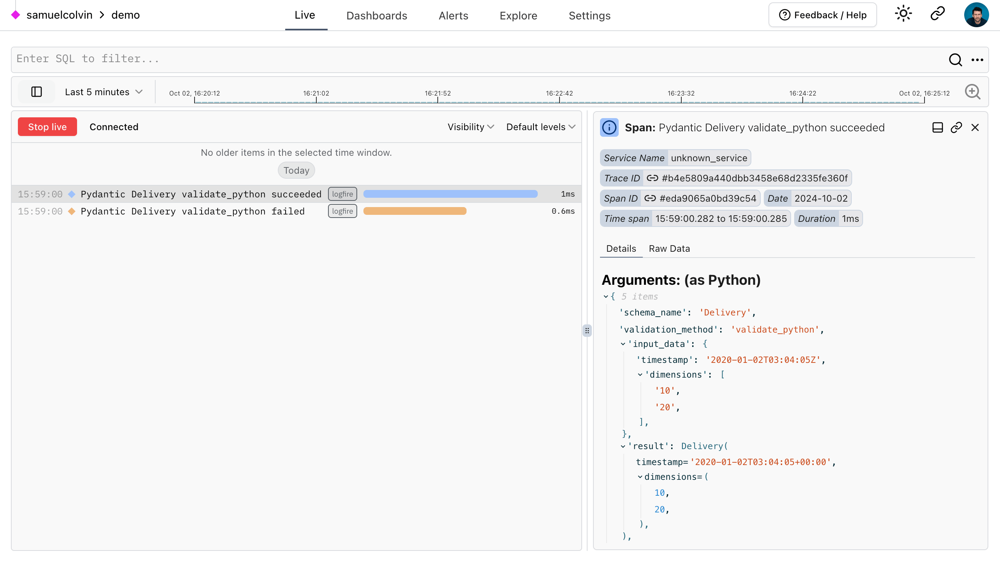

# Pydantic Validation

Pydantic 是 Python 中最广泛使用的数据验证库。

快速且可扩展，Pydantic 与您的 linter/IDE/大脑完美配合。使用纯正的、规范的 Python 3.9+ 定义数据应该是什么样子；用 Pydantic Validation。

??? logfire "使用 Pydantic Logfire 监控 Pydantic :fire:"
    **[Pydantic Logfire](https://pydantic.dev/logfire)** 是一个应用程序监控工具，使用起来和 Pydantic 本身一样简单而强大。

    Logfire 集成了许多流行的 Python 库，包括 FastAPI、OpenAI 和 Pydantic 本身，因此您可以使用 Logfire 监控 Pydantic 验证，并了解为什么某些输入验证失败：

    ```python {title="使用 Logfire 监控 Pydantic" test="skip"}
    from datetime import datetime

    import logfire

    from pydantic import BaseModel

    logfire.configure()
    logfire.instrument_pydantic()  # (1)!


    class Delivery(BaseModel):
        timestamp: datetime
        dimensions: tuple[int, int]


    # 这将记录成功验证的详细信息到 logfire
    m = Delivery(timestamp='2020-01-02T03:04:05Z', dimensions=['10', '20'])
    print(repr(m.timestamp))
    #> datetime.datetime(2020, 1, 2, 3, 4, 5, tzinfo=TzInfo(UTC))
    print(m.dimensions)
    #> (10, 20)

    Delivery(timestamp='2020-01-02T03:04:05Z', dimensions=['10'])  # (2)!
    ```

    1. 设置 logfire 记录所有成功和失败的验证，使用 `record='failure'` 仅记录失败的验证，[了解更多](https://logfire.pydantic.dev/docs/integrations/pydantic/)。
    2. 这将引发 `ValidationError`，因为 `dimensions` 太少，输入数据和验证错误的详细信息将被记录在 Logfire 中。

    在 Logfire 平台中会显示如下视图：

    [](https://logfire.pydantic.dev/docs/guides/web-ui/live/)

    这只是一个简单的示例，但希望能清楚地展示在更复杂的应用程序中进行检测的潜在价值。

    **[了解更多关于 Pydantic Logfire](https://logfire.pydantic.dev/docs/)**

## 为什么使用 Pydantic？

* **类型提示** &mdash; 使用 Pydantic，模式验证和序列化由类型注解控制；学习成本更低，代码更少，并与您的 IDE 和静态分析工具集成。[了解更多…](why.md#type-hints)
* **速度快** &mdash; Pydantic 的核心验证逻辑是用 Rust 编写的。因此，Pydantic 是 Python 中最快的数据验证库之一。[了解更多…](why.md#performance)
* **JSON Schema** &mdash; Pydantic 模型可以生成 JSON Schema，便于与其他工具集成。[了解更多…](why.md#json-schema)
* **严格** 和 **宽松** 模式 &mdash; Pydantic 可以在严格模式（数据不转换）或宽松模式下运行，在适当的情况下 Pydantic 会尝试将数据强制转换为正确的类型。[了解更多…](why.md#strict-lax)
* **Dataclasses**、**TypedDicts** 等 &mdash; Pydantic 支持验证许多标准库类型，包括 `dataclass` 和 `TypedDict`。[了解更多…](why.md#dataclasses-typeddict-more)
* **自定义** &mdash; Pydantic 允许自定义验证器和序列化器，以多种强大的方式改变数据处理方式。[了解更多…](why.md#customisation)
* **生态系统** &mdash; PyPI 上约有 8,000 个包使用 Pydantic，包括非常流行的库如 *FastAPI*、*huggingface*、*Django Ninja*、*SQLModel* 和 *LangChain*。[了解更多…](why.md#ecosystem)
* **经过实战检验** &mdash; Pydantic 每月下载量超过 3.6 亿次，被所有 FAANG 公司和纳斯达克 25 家最大公司中的 20 家使用。如果您想用 Pydantic 做某事，可能已经有人做过了。[了解更多…](why.md#using-pydantic)

[安装 Pydantic](install.md) 非常简单

=== "uv"

    ```bash
    uv add pydantic
    ```

=== "pip"

    ```bash
    pip install pydantic
    ```

## Pydantic 示例

要了解 Pydantic 的工作原理，让我们从一个简单的示例开始，创建一个继承自 `BaseModel` 的自定义类：

```python {upgrade="skip" title="验证成功" requires="3.10"}
from datetime import datetime

from pydantic import BaseModel, PositiveInt


class User(BaseModel):
    id: int  # (1)!
    name: str = 'John Doe'  # (2)!
    signup_ts: datetime | None  # (3)!
    tastes: dict[str, PositiveInt]  # (4)!


external_data = {
    'id': 123,
    'signup_ts': '2019-06-01 12:22',  # (5)!
    'tastes': {
        'wine': 9,
        b'cheese': 7,  # (6)!
        'cabbage': '1',  # (7)!
    },
}

user = User(**external_data)  # (8)!

print(user.id)  # (9)!
#> 123
print(user.model_dump())  # (10)!
"""
{
    'id': 123,
    'name': 'John Doe',
    'signup_ts': datetime.datetime(2019, 6, 1, 12, 22),
    'tastes': {'wine': 9, 'cheese': 7, 'cabbage': 1},
}
"""
```

1. `id` 是 `int` 类型；仅通过注解声明告诉 Pydantic 此字段是必需的。如果可能，字符串、字节或浮点数将被强制转换为整数；否则将引发异常。
2. `name` 是一个字符串；因为它有默认值，所以不是必需的。
3. `signup_ts` 是一个 [`datetime`][datetime.datetime] 字段，是必需的，但可以提供值 `None`；Pydantic 将处理 [Unix 时间戳](https://en.wikipedia.org/wiki/Unix_time)整数（例如 `1496498400`）或表示日期和时间的字符串。
4. `tastes` 是一个具有字符串键和正整数值的字典。`PositiveInt` 类型是 `Annotated[int, annotated_types.Gt(0)]` 的简写。
5. 这里的输入是 [ISO 8601](https://en.wikipedia.org/wiki/ISO_8601) 格式的日期时间，但 Pydantic 会将其转换为 [`datetime`][datetime.datetime] 对象。
6. 这里的键是 `bytes`，但 Pydantic 会负责将其强制转换为字符串。
7. 类似地，Pydantic 会将字符串 `'1'` 强制转换为整数 `1`。
8. 我们通过将外部数据作为关键字参数传递给 `User` 来创建 `User` 的实例。
9. 我们可以将字段作为模型的属性访问。
10. 我们可以使用 [`model_dump()`][pydantic.BaseModel.model_dump] 将模型转换为字典。

如果验证失败，Pydantic 将引发错误并详细说明问题所在：

```python {upgrade="skip" title="验证错误" test="skip" lint="skip"}
# 继续上面的示例...

from datetime import datetime
from pydantic import BaseModel, PositiveInt, ValidationError


class User(BaseModel):
    id: int
    name: str = 'John Doe'
    signup_ts: datetime | None
    tastes: dict[str, PositiveInt]


external_data = {'id': 'not an int', 'tastes': {}}  # (1)!

try:
    User(**external_data)  # (2)!
except ValidationError as e:
    print(e.errors())
    """
    [
        {
            'type': 'int_parsing',
            'loc': ('id',),
            'msg': 'Input should be a valid integer, unable to parse string as an integer',
            'input': 'not an int',
            'url': 'https://errors.pydantic.dev/2/v/int_parsing',
        },
        {
            'type': 'missing',
            'loc': ('signup_ts',),
            'msg': 'Field required',
            'input': {'id': 'not an int', 'tastes': {}},
            'url': 'https://errors.pydantic.dev/2/v/missing',
        },
    ]
    """
```

1. 这里的输入数据是错误的 &mdash; `id` 不是有效的整数，并且 `signup_ts` 缺失。
2. 尝试实例化 `User` 将引发 [`ValidationError`][pydantic_core.ValidationError] 并附带错误列表。

## 谁在使用 Pydantic？

数百个组织和包正在使用 Pydantic。世界各地一些使用 Pydantic 的知名公司和组织包括：

{{ organisations }}

有关使用 Pydantic 的开源项目的更全面列表，请参阅 [github 上的依赖项列表](https://github.com/pydantic/pydantic/network/dependents)，或者您可以在 [awesome-pydantic](https://github.com/Kludex/awesome-pydantic) 中找到一些使用 Pydantic 的优秀项目。