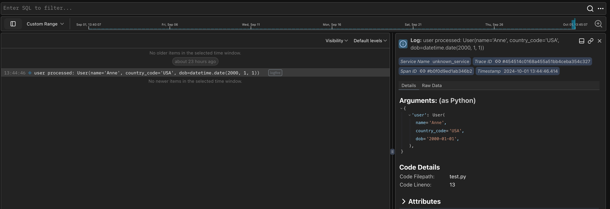
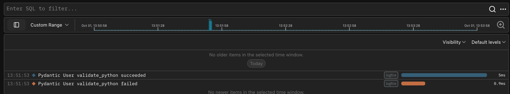
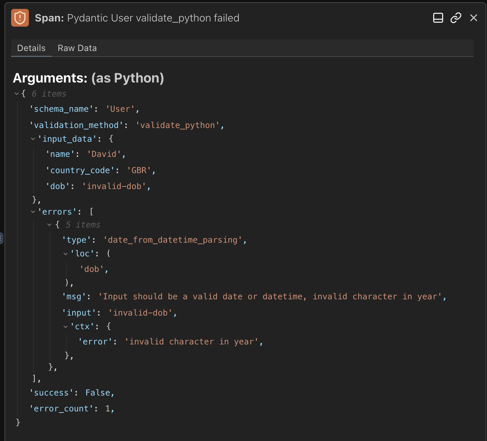

Pydantic 与 **Pydantic Logfire** 无缝集成，这是一个由我们构建的可观测性平台，基于与我们开源库相同的信念——最强大的工具可以易于使用。

## 入门指南

Logfire 提供了开箱即用的 Pydantic 集成，让您能够理解通过 Pydantic 模型传递的数据并获取验证分析。对于现有的 Pydantic 用户，它提供了对 Pydantic 模型使用情况的独特洞察。

[开始使用](https://logfire.pydantic.dev/docs/) Logfire 可以通过三个简单步骤完成：

1. 设置您的 Logfire 账户。
2. 安装 Logfire SDK。
3. 对您的项目进行插桩。

### 基本用法

一旦您设置好 Logfire，就可以开始使用它来监控您的 Pydantic 模型并获取数据验证的洞察：

```python {test="skip"}
from datetime import date

import logfire

from pydantic import BaseModel

logfire.configure()  # (1)!


class User(BaseModel):
    name: str
    country_code: str
    dob: date


user = User(name='Anne', country_code='USA', dob='2000-01-01')
logfire.info('user processed: {user!r}', user=user)  # (2)!
```

1. `logfire.configure()` 调用是您使用 Logfire 对项目进行插桩所需的全部操作。
2. `logfire.info()` 调用将 `user` 对象记录到 Logfire，内置对 Pydantic 模型的支持。



### Pydantic 插桩

您甚至可以通过使用内置的 [Pydantic 集成](https://logfire.pydantic.dev/docs/why-logfire/pydantic/) 自动记录验证过程的信息：

```python {test="skip"}
from datetime import date

import logfire

from pydantic import BaseModel

logfire.configure()
logfire.instrument_pydantic()  # (1)!


class User(BaseModel):
    name: str
    country_code: str
    dob: date


User(name='Anne', country_code='USA', dob='2000-01-01')
User(name='David', country_code='GBR', dob='invalid-dob')
```

1. `logfire.instrument_pydantic()` 调用会自动记录项目中所有 Pydantic 模型的验证信息。

您将在 Logfire 中看到每个成功和失败的验证都被记录下来：



您可以调查每个相应的 span 来获取验证详情：



<!-- TODO: 添加关于跟踪性能问题的示例 - 我们想要使用什么样的示例？ -->