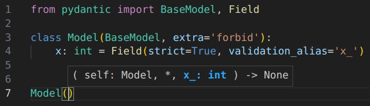

[Pyrefly](https://pyrefly.org/) 是一个 Python 类型检查器和语言服务器，内置了对许多 Pydantic 特定功能的支持。这种支持在安装了 Pydantic 和 Pyrefly 后即可开箱即用，无需额外配置。

Pyrefly 既可以作为 [IDE 扩展](https://pyrefly.org/en/docs/IDE/) 使用，也可以作为 [命令行类型检查器](https://pyrefly.org/en/docs/installation/) 使用。

## IDE 扩展

Pyrefly 为您提供 IDE 功能，例如在 Pydantic 模型上的跳转到定义和自动补全。

以下是一个签名帮助的示例，由 Pyrefly 对 Pydantic 特定的 `validation_alias` 关键字的理解提供支持：



当您输入 `Model()` 时，Pyrefly 提示您需要使用名称 `x_` 来填充 `x` 字段。

## 类型检查器

Pyrefly 还可以在您运行代码之前捕获错误。考虑以下示例：

```python {test="skip" linenums="1"}
from pydantic import BaseModel, ConfigDict


class Model1(BaseModel, frozen=True):
    x: int


class Model2(BaseModel):
    model_config = ConfigDict(frozen=True)
    x: int


model1 = Model1(x=0)
model1.x = 1  # validation error: mutating a frozen field

model2 = Model2(x=0)
model2.x = 1  # validation error: mutating a frozen field
```

由于 `Model1` 使用 [标准类型系统功能](https://typing.python.org/en/latest/spec/dataclasses.html#the-dataclass-transform-decorator) 声明它是冻结的，任何您选择的类型检查器都会捕获修改 `model1.x` 的验证错误。然而，没有对 Pydantic `ConfigDict` 类特殊支持的类型检查器会错过修改 `model2.x` 的验证错误。

Pyrefly 捕获了这两个错误：

```output
ERROR Cannot set field `x` [read-only]
  --> foo.py:11:1
   |
11 | model1.x = 1  # validation error: mutating a frozen field
   | ^^^^^^^^
   |
  This field belongs to a frozen Pydantic model
ERROR Cannot set field `x` [read-only]
  --> foo.py:14:1
   |
14 | model2.x = 1  # validation error: mutating a frozen field
   | ^^^^^^^^
   |
  This field belongs to a frozen Pydantic model
```

有关更多信息，请参阅 [Pyrefly 文档](https://pyrefly.org/en/docs/pydantic/)。