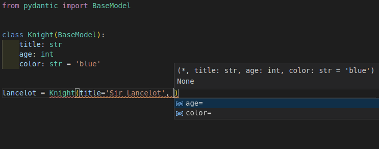
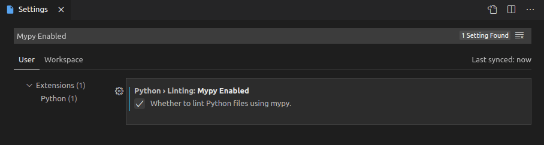
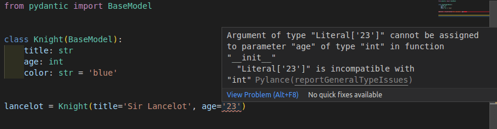
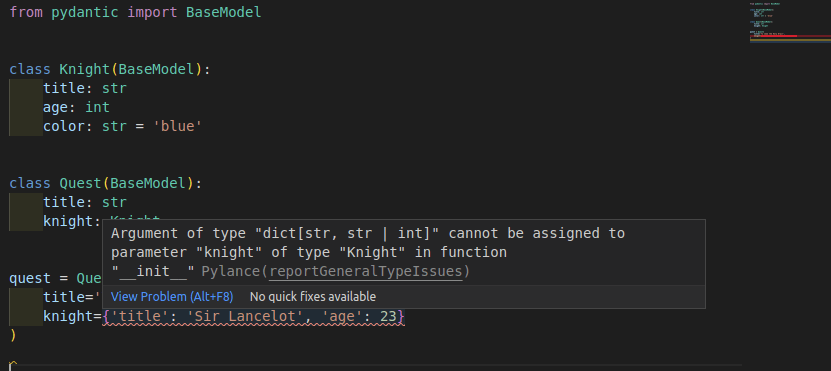

Pydantic 与任何编辑器或 IDE 都能很好地开箱即用，因为它建立在标准 Python 类型注解之上。

当使用 [Visual Studio Code (VS Code)](https://code.visualstudio.com/) 时，支持一些**额外的编辑器功能**，与 [PyCharm 插件](../integrations/pycharm.md) 提供的功能相当。

这意味着即使在创建新的 Pydantic 模型实例时，您也将拥有**自动补全**（或 "IntelliSense"）和针对类型及必需参数的**错误检查**。



## 配置 VS Code

要利用这些功能，您需要确保正确配置 VS Code，使用推荐的设置。

如果您有不同的配置，这里简要概述一下步骤。

### 安装 Pylance

您应该使用 VS Code 的 [Pylance](https://marketplace.visualstudio.com/items?itemName=ms-python.vscode-pylance) 扩展。它是推荐的、新一代的官方 VS Code Python 插件。

Pylance 默认作为 [VS Code 的 Python 扩展](https://marketplace.visualstudio.com/items?itemName=ms-python.python) 的一部分安装，因此它应该可以直接工作。否则，您可以再次检查它是否已安装并在编辑器中启用。

### 配置您的环境

然后您需要确保编辑器知道您的 Python 项目的 [Python 环境](https://code.visualstudio.com/docs/python/python-tutorial#_install-and-use-packages)（可能是一个虚拟环境）。

这应该是您安装 Pydantic 的环境。

### 配置 Pylance

使用默认配置，您将获得自动补全支持，但 Pylance 可能不会检查类型错误。

您可以通过以下步骤启用 Pylance 的类型错误检查：

* 打开"用户设置"
* 搜索 `Type Checking Mode`
* 您将在 `Python › Analysis: Type Checking Mode` 下找到一个选项
* 将其设置为 `basic` 或 `strict`（默认为 `off`）


现在，当创建新的 Pydantic 模型实例时，您不仅会获得自动补全，还会获得对**必需参数**的错误检查。


您还将获得对**无效数据类型**的错误检查。


!!! note "技术细节"
    Pylance 是 VS Code 扩展，它是闭源的，但可以免费使用。在底层，Pylance 使用一个名为 [Pyright](https://github.com/microsoft/pyright) 的开源工具（也来自 Microsoft）来完成所有繁重的工作。

    您可以在 [Pylance 常见问题解答](https://github.com/microsoft/pylance-release/blob/main/FAQ.md#what-is-the-relationship-between-pylance-pyright-and-the-python-extension) 中了解更多信息。

### 配置 mypy

您可能还希望在 VS Code 中配置 mypy，以便在编辑器中获得内联的 mypy 错误检查（作为 Pylance 的替代或补充）。

这将包括 [Pydantic mypy 插件](../integrations/mypy.md) 检测到的错误（如果您已配置它）。

要在 VS Code 中启用 mypy，请执行以下操作：

* 打开"用户设置"
* 搜索 `Mypy Enabled`
* 您将在 `Python › Linting: Mypy Enabled` 下找到一个选项
* 勾选该框（默认未勾选）



## 提示和技巧

以下是一些额外的提示和技巧，可改善您在使用 VS Code 与 Pydantic 时的开发体验。

### 严格错误

这种额外编辑器支持的工作方式是，Pylance 会将您的 Pydantic 模型视为 Python 的纯 `dataclasses`。

它将在创建新的 Pydantic 模型实例时显示关于参数中传递的数据类型的**严格类型错误检查**。

在这个示例中，您可以看到它显示一个值为 `'23'` 的 `str` 对于参数 `age` 不是有效的 `int`。



它期望的是 `age=23` 而不是 `age='23'`。

然而，Pydantic 的设计和主要特性之一是它对**数据类型非常宽容**。

它实际上会接受值为 `'23'` 的 `str`，并将其转换为值为 `23` 的 `int`。

这些严格错误检查在大多数情况下**非常有用**，可以帮助您**及早发现许多错误**。但在某些情况下，比如 `age='23'`，它们可能会因为报告"假阳性"错误而带来不便。

---

上面的 `age='23'` 示例故意简化，以显示错误和类型差异。

但这些严格错误会带来不便的更常见情况是使用更复杂的数据类型时，比如为 `datetime` 字段使用 `int` 值，或为 Pydantic 子模型使用 `dict` 值。

例如，这对 Pydantic 是有效的：

```python {hl_lines="12 17"}
from pydantic import BaseModel


class Knight(BaseModel):
    title: str
    age: int
    color: str = 'blue'


class Quest(BaseModel):
    title: str
    knight: Knight


quest = Quest(
    title='To seek the Holy Grail', knight={'title': 'Sir Lancelot', 'age': 23}
)
```

字段 `knight` 的类型是用类 `Knight`（一个 Pydantic 模型）声明的，而代码传递的是一个字面量 `dict`。这对 Pydantic 仍然是有效的，`dict` 将自动转换为 `Knight` 实例。

然而，它将被检测为类型错误：



在这些情况下，有几种方法可以在非常特定的地方禁用或忽略严格错误，同时仍然在代码的其余部分保留它们。

以下是几种实现此目的的技术。

#### 在行中禁用类型检查

您可以使用以下注释为特定行禁用错误：

```python
# type: ignore
```

或（特定于 pylance/pyright）：

```python
# pyright: ignore
```

（[pyright](https://github.com/microsoft/pyright) 是 Pylance 使用的语言服务器）。

回到 `age='23'` 的示例，它将是：

```python {hl_lines="10"}
from pydantic import BaseModel


class Knight(BaseModel):
    title: str
    age: int
    color: str = 'blue'


lancelot = Knight(title='Sir Lancelot', age='23')  # pyright: ignore
```

这样 Pylance 和 mypy 将忽略该行中的错误。

**优点**：只需在该行进行简单更改即可移除错误。

**缺点**：该行中的任何其他错误也将被忽略，包括类型检查、拼写错误的参数、未提供的必需参数等。

#### 重写变量的类型

您还可以创建一个包含要使用的值的变量，并使用 `Any` 显式声明其类型。

```python {hl_lines="1 11-12"}
from typing import Any

from pydantic import BaseModel


class Knight(BaseModel):
    title: str
    age: int
    color: str = 'blue'


age_str: Any = '23'
lancelot = Knight(title='Sir Lancelot', age=age_str)
```

这样 Pylance 和 mypy 将解释变量 `age_str`，就好像它们不知道其类型一样，而不是知道它有一个 `str` 类型，而期望的是 `int`（然后显示相应的错误）。

**优点**：错误将仅针对特定值被忽略，您仍然会看到其他参数的任何额外错误。

**缺点**：它需要导入 `Any`，并为每个需要忽略错误的参数在新行中创建一个新变量。

#### 使用 `cast` 重写值的类型

前一个示例的相同想法可以借助 `cast()` 放在同一行中。

这样，值的类型声明被内联重写，不需要额外的变量。

```python {hl_lines="1 11"}
from typing import Any, cast

from pydantic import BaseModel


class Knight(BaseModel):
    title: str
    age: int
    color: str = 'blue'


lancelot = Knight(title='Sir Lancelot', age=cast(Any, '23'))
```

`cast(Any, '23')` 不会影响值，它仍然只是 `'23'`，但现在 Pylance 和 mypy 将假定它是 `Any` 类型，这意味着它们将表现得好像不知道值的类型。

所以，这等同于前一个示例，但没有额外的变量。

**优点**：错误将仅针对特定值被忽略，您仍然会看到其他参数的任何额外错误。不需要额外的变量。

**缺点**：它需要导入 `Any` 和 `cast`，如果您不习惯使用 `cast()`，一开始可能会觉得奇怪。

### 类参数中的配置

Pydantic 提供了丰富的[模型配置][pydantic.config.ConfigDict]集。

这些配置可以在每个模型的内部 `class Config` 中设置：

```python {hl_lines="9-10"}
from pydantic import BaseModel


class Knight(BaseModel):
    model_config = dict(frozen=True)
    title: str
    age: int
    color: str = 'blue'
```

或在定义模型类时作为关键字参数传递：

```python {hl_lines="4"}
from pydantic import BaseModel


class Knight(BaseModel, frozen=True):
    title: str
    age: int
    color: str = 'blue'
```

特定的配置 **`frozen`**（测试版）具有特殊含义。

它阻止其他代码在模型实例创建后更改它，使其保持**"冻结"**状态。

当使用第二个版本声明 `frozen=True`（在类定义中使用**关键字参数**）时，
Pylance 可以使用它来帮助您在代码中检查并**检测错误**，当某些东西试图在"冻结"的模型中设置值时。


## 使用 `Field` 添加默认值

Pylance/pyright 要求 `default` 是 `Field` 的关键字参数，以便推断该字段是可选的。

```python
from pydantic import BaseModel, Field


class Knight(BaseModel):
    title: str = Field(default='Sir Lancelot')  # 这是可以的
    age: int = Field(
        23
    )  # 这在运行时工作正常，但会导致 pyright 错误


lance = Knight()  # 错误：缺少参数 "age"
```

这是 dataclass 转换的限制，无法在 pydantic 中修复。

## 技术细节

!!! warning
    作为 Pydantic 用户，您不需要下面的详细信息。可以随意跳过本节的其余部分。

    这些细节仅对其他库作者等有用。

这种额外的编辑器支持是通过利用 [`@dataclass_transform` 装饰器](https://typing.python.org/en/latest/spec/dataclasses.html#the-dataclass-transform-decorator)
（由 [PEP 681](https://peps.python.org/pep-0681/) 引入）来实现的。

该标准为 Pydantic 等库提供了一种方式，告诉编辑器和工具它们（编辑器）应该将这些库（例如 Pydantic）视为 [dataclasses][dataclasses]，提供自动补全、类型检查等功能。